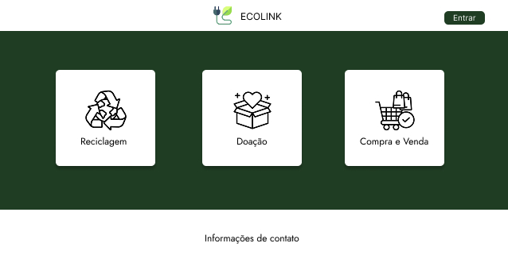
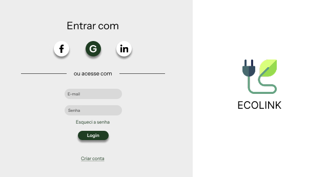
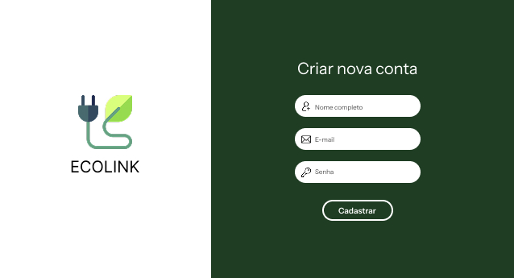
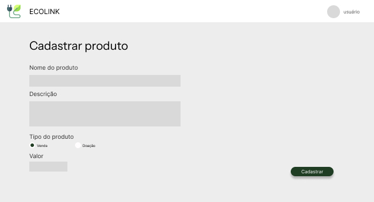
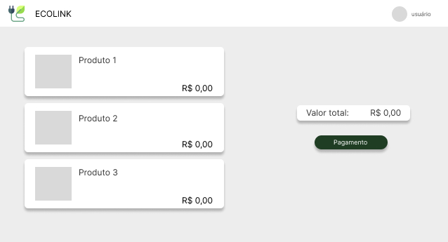

# Projeto de Interface

## User Flow e Wireframes

### Tela inicial

A tela inicial apresenta as 3 principais sessões do site que encaminham o usuário para a acessar determinada área. Abaixo temos a tela inicial com um botão onde o usuário irá ser encaminhado para entrar com sua conta ou criar uma conta, e, a tela inicial com o usuário logado.

### Tela de login

A tela de login apresenta as opções de acesso que o usuário possui de fazer login e também possui um link onde o usuário será encaminhado para criar uma conta. Nesta tela, é apresentado o seguinte requisito: RF-004.

### Tela de cadastro de conta

A tela de cadastro de conta apresenta as informações que o usuário precisa informar para criar uma conta. Nesta tela, é apresentado o seguinte requisito: RF-001.

### Tela de cadastro de produto

A tela de cadastro de produto apresenta as informações que o usuário precisa informar para cadastrar um produto, tanto para venda, quanto para doação. Nesta tela, é apresentado o seguinte requisito: RF-007.

### Tela de carrinho de compras

A tela de carrinho de compras apresenta para o usuário os produtos escolhidos para comprar e o valor total do pedido. Nesta tela, é apresentado o seguinte requisito: RF-005.

